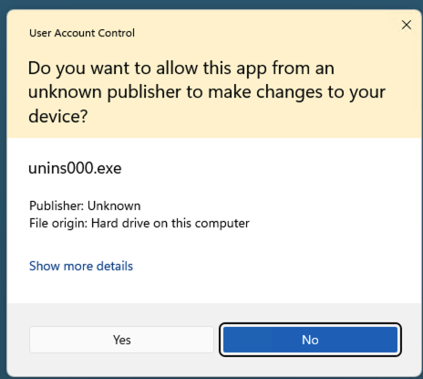
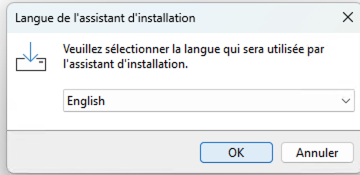
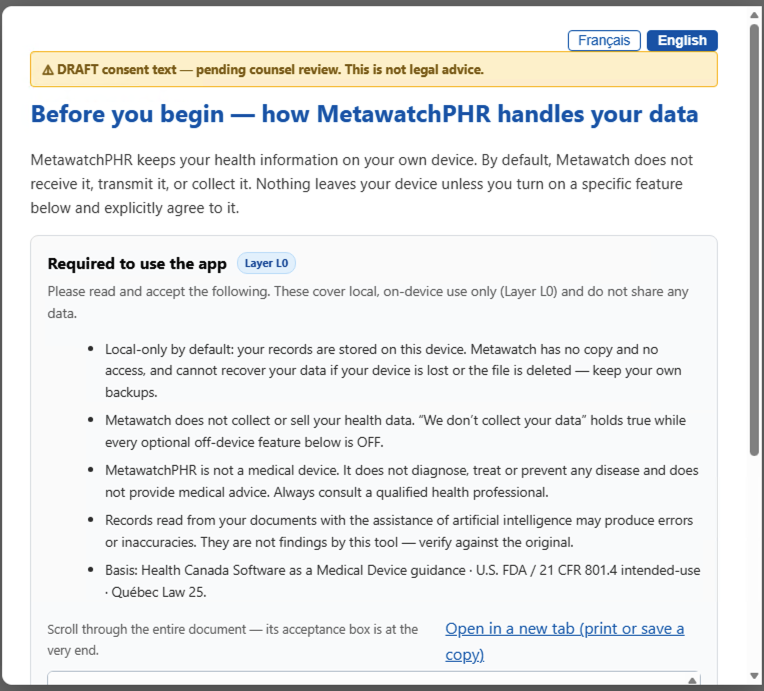
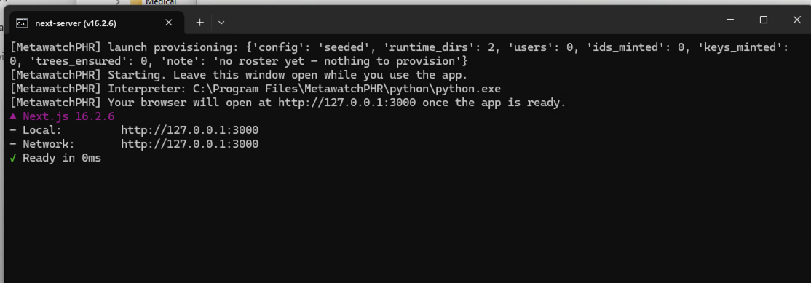
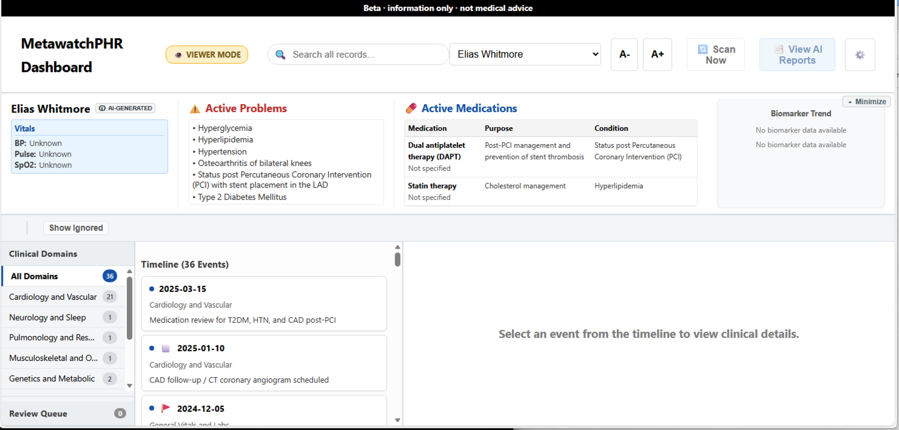
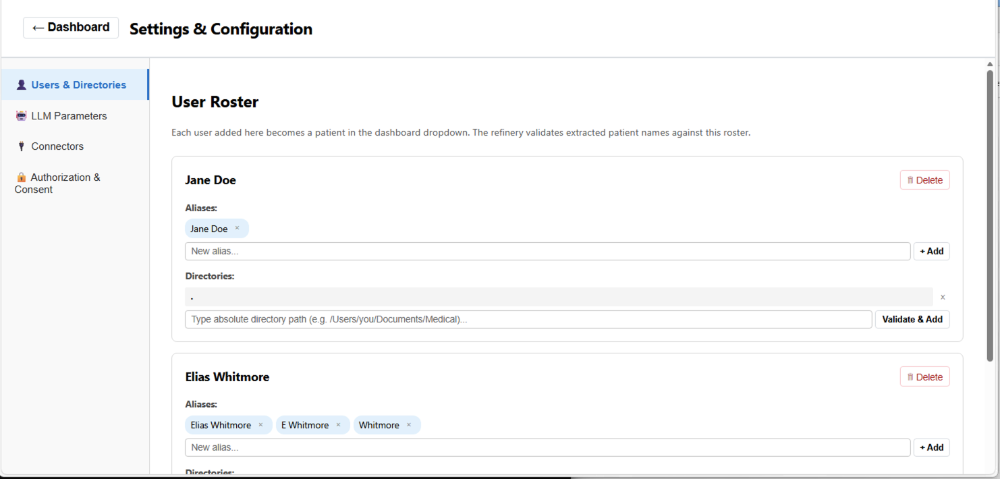
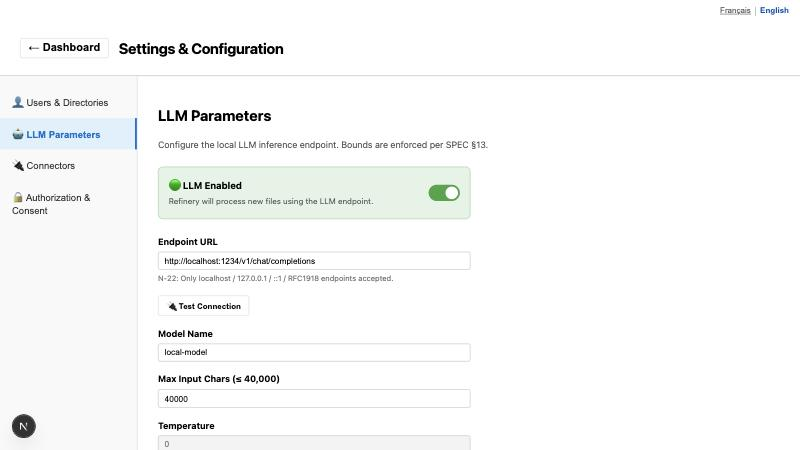
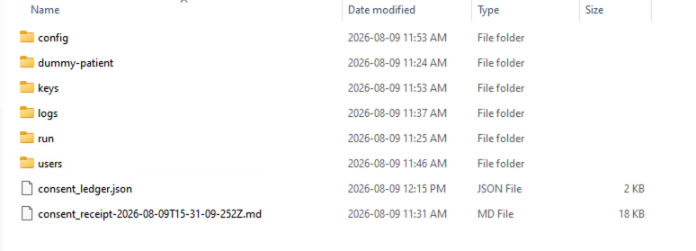
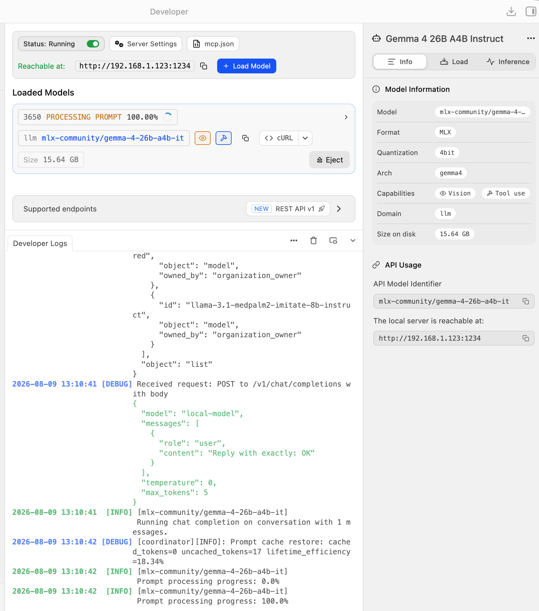

<!-- CLASSIFICATION: PUBLIC · Guide d'utilisation MetawatchPHR (FR) -->

# Guide d'utilisation de MetawatchPHR

**Version du document :** v6.1 · **Dernière modification :** 2026-08-12
**S'applique à :** MetawatchPHR 0.2.0, version `c002cb9162ef` · **bêta Windows** (version macOS en préparation)

---

Bienvenue dans **MetawatchPHR**, votre raffinerie de données de santé personnelle et entièrement locale. MetawatchPHR prend vos fichiers médicaux épars et non structurés — PDF, documents Word, tableurs Excel, texte brut et exportations hospitalières — et les forge en une ligne du temps unifiée et cliniquement cohérente que vous pouvez lire, représenter graphiquement et interroger.

Ce guide vous accompagne dans l'installation, l'ajout d'utilisateurs, la configuration de votre IA locale, l'usage quotidien et les normes médicales qui font fonctionner le système.

## 0. Ce qu'il vous faut avant de commencer (configuration requise)

- **Windows 10 ou 11, 64 bits.** (La version macOS est en préparation ; cette bêta est réservée à Windows.)
- **[LM Studio](https://lmstudio.ai)** — une application gratuite qui exécute le modèle d'IA localement sur votre machine. MetawatchPHR effectue son travail d'IA par l'intermédiaire de LM Studio afin que rien ne quitte jamais votre ordinateur. Voir l'**annexe A** pour la configuration exacte.
- **Assez de mémoire pour le modèle d'IA choisi.** LM Studio vous indique si un modèle convient à votre machine avant de le charger (voir les recommandations de modèles à la section 3).
- **De l'espace disque** pour l'application (quelques centaines de Mo) et pour vos dossiers traités.
- Rien d'autre — l'installateur embarque tout ce dont l'application a besoin. Vous n'installez ni Python, ni Node, ni aucun autre logiciel.

## 1. Installation et garanties de confidentialité

MetawatchPHR est distribué comme application de bureau autonome.

1. **Téléchargez l'installateur.** Le nom du fichier ressemble à `MetawatchPHR-Setup-0.2.0-c002cb9162ef.exe`. Les lettres et les chiffres à la fin identifient votre version exacte — **si vous signalez un problème, incluez ce code de version** ; il nous indique précisément quelle version vous utilisez. Si un téléchargement arrive plus petit que prévu, retéléchargez directement plutôt qu'à travers un dossier synchronisé — les disques infonuagiques peuvent vous remettre un fichier partiel.
2. **Attendez-vous à un avertissement de Windows — c'est normal.** L'installateur de la bêta n'est pas encore signé numériquement : SmartScreen affiche *« Windows a protégé votre ordinateur »* (cliquez sur **Informations complémentaires → Exécuter quand même**), et le Contrôle de compte d'utilisateur signale un *« éditeur inconnu »* (cliquez sur **Oui**). Ces avertissements apparaissent pour chaque testeur de la bêta.

   
3. **L'installateur s'exécute d'abord en français.** MetawatchPHR est conçu selon les exigences linguistiques du Québec : l'installateur et les écrans de premier lancement présentent le français par défaut. Choisir l'anglais se fait en un clic — et ce choix constitue lui-même votre accord pour poursuivre en anglais.

   
4. **Acceptez les ententes — vous devez faire défiler jusqu'à la fin.** Au premier lancement, l'application présente ses deux documents directeurs, l'un après l'autre : le **contrat de licence d'utilisateur final**, puis la **politique de confidentialité**. Chacun apparaît intégralement dans un lecteur défilant, et sa case à cocher ne devient cliquable **qu'après que vous ayez fait défiler le texte jusqu'à la fin**. Si une case semble grisée, continuez de défiler — c'est voulu, ce n'est pas un défaut. Une fois les deux acquittées, le bouton d'acceptation s'active. Un **reçu de consentement** consignant ce que vous avez accepté, et dans quelle langue, est inscrit dans votre dossier de données, pour vos propres archives.

   
5. **Votre environnement de données est provisionné automatiquement** à `%LOCALAPPDATA%\OpenPHR` sous Windows. *(Note : le dossier porte le nom interne de la plateforme, OpenPHR — le produit s'appelle MetawatchPHR. Une mise à jour future alignera le nom du dossier ; vos données ne sont pas touchées.)*
6. **Le premier lancement prend quelques minutes.** Le lanceur ouvre une fenêtre de console, prépare votre environnement de données et attend jusqu'à environ 3 minutes le démarrage du serveur local à froid — **laissez cette fenêtre ouverte pendant que vous utilisez l'application.** Si votre navigateur affiche d'abord « impossible d'accéder à cette page », patientez un instant et actualisez. Si un autre programme occupe déjà le port par défaut, MetawatchPHR en trouve automatiquement un libre.

   

**La confidentialité — d'abord et toujours.** MetawatchPHR n'est pas hébergé dans le nuage. Vos dossiers de santé ne quittent jamais votre machine. Tout le traitement par IA s'effectue auprès de votre point d'accès d'IA local, et le système fonctionne hors ligne par défaut. Dans la configuration standard, le seul appel réseau jamais effectué est une validation de licence unique si vous achetez un connecteur payant — et cet appel ne contient aucune donnée de santé.

**Faites connaissance avec le patient de démonstration.** Chaque nouvelle installation comprend un patient de démonstration intégré aux dossiers synthétiques, afin que vous puissiez explorer la ligne du temps, les graphiques et la recherche avant de balayer quoi que ce soit qui vous appartienne. Ce patient est délibérément **en lecture seule et ne peut être supprimé** — c'est votre bac à sable permanent et sans risque.

## 2. Configuration et ajout d'un utilisateur

MetawatchPHR prend en charge plusieurs utilisateurs sur une même machine, avec une isolation stricte entre eux. Pour créer un nouvel utilisateur, ajoutez-le explicitement au registre des utilisateurs (« User Roster ») :

1. **Ouvrez le tableau de bord** — lancez MetawatchPHR pour ouvrir le tableau de bord dans le navigateur.
2. **Allez dans les réglages (« Settings »)** — cliquez sur l'icône d'engrenage.
3. **Ouvrez la page du registre des utilisateurs.**
4. **Cliquez sur « Add User » (ajouter un utilisateur).**
5. **Remplissez les renseignements de la personne :**
   - **Prénom et nom** — servent à générer l'identifiant interne et à vérifier que les documents extraits appartiennent bien à cette personne.
   - **Alias** (facultatif) — surnoms, initiales ou noms de naissance que l'IA doit reconnaître comme désignant cette personne. Les ajouter améliore la correspondance sur des documents réels.
6. **Indiquez le chemin du répertoire source (CRITIQUE)** — le dossier de votre ordinateur où résident les fichiers médicaux bruts de cette personne (p. ex. `C:\Users\Vous\Documents\DossiersSante`). Le système ne balaie **que** ce répertoire pour cette personne et respecte strictement la frontière — les données de deux utilisateurs ne sont jamais mêlées. *(Astuce : si vous collez un chemin obtenu par « Copier en tant que chemin d'accès » sous Windows, il arrive entouré de guillemets — retirez-les.)*
7. **Enregistrez.** Le système provisionne un dossier dédié et sécurisé pour cette personne (`%LOCALAPPDATA%\OpenPHR\users\<identifiant>`). Tous les dossiers traités y résident en permanence.

## 3. Configuration de l'IA (le modèle de langage)

MetawatchPHR s'appuie sur un modèle de langage pour extraire des données cliniques structurées de vos fichiers non structurés. Par défaut, il s'attend à un modèle **local et hors ligne** servi par LM Studio, de sorte qu'aucune donnée ne quitte votre machine.

1. **Allez dans Settings → panneau LLM.**
2. **Réglez le point d'accès** — l'adresse de votre moteur d'IA local, normalement `http://localhost:1234/v1/chat/completions`. Vous pouvez aussi régler le nom du modèle, le nombre maximal de caractères et la **température — utilisez `0.1`** (extraction quasi déterministe, avec juste assez de souplesse pour la synthèse clinique).
3. **Choisissez votre modèle selon la plateforme :**
   - **Windows (cette bêta) :** `Gemma 3 12B IT Q5_K_M` — excellent raisonnement clinique pour une empreinte mémoire modérée, au format GGUF utilisé par LM Studio sous Windows.
   - **Mac, 32 Go (version à venir ; notre machine de référence) :** `mlx-community/gemma-4-26b-a4b-it` — le modèle phare, rigoureusement testé pour une précision clinique maximale. *(Les modèles MLX sont réservés au Mac — sous Windows, utilisez le modèle GGUF ci-dessus.)*
4. **Test Connection** — utilisez le bouton intégré pour valider que MetawatchPHR peut joindre votre modèle avant de lancer un balayage.

**Garde-fou pour une IA externe ou infonuagique.** Si vous pointez MetawatchPHR vers une IA hébergée dans le nuage plutôt que locale, une garde de consentement stricte intervient : le système détecte l'adresse non locale, s'interrompt avant l'enregistrement et présente un avertissement clair indiquant qu'envoyer des dossiers médicaux à un service externe comporte intrinsèquement un risque pour votre vie privée. Vous devez accorder explicitement le consentement de traitement externe pour cet hôte précis — sinon la modification est bloquée et vos dossiers restent sur l'appareil.

## 4. Usage quotidien : le déroulement d'un balayage

1. **Démarrez votre IA locale** — ouvrez LM Studio, chargez votre modèle, démarrez le serveur sur le port 1234 (annexe A).
2. **Déposez vos fichiers** — placez vos nouveaux documents médicaux dans votre répertoire source.
3. **Scan Now** — cliquez sur le bouton dans le tableau de bord. Le système vérifie la connexion à l'IA et commence le traitement.
4. **Lisez votre reçu** — chaque balayage produit un rapport clair, `scan_report.md`, qui vous indique quels fichiers ont été intégrés, lesquels ont été ignorés et pourquoi (p. ex. des fichiers logiciels non médicaux sur un disque d'hôpital), et lesquels ont été mis en quarantaine pour votre examen.

**Types de fichiers pris en charge :** PDF, Word, Excel/CSV, texte brut, exportations hospitalières C-CDA en XML, et imagerie médicale DICOM (balises et en-têtes cliniques — avec une visionneuse intégrée). **Pas encore pris en charge :** les photographies de documents (p. ex. un `.jpeg` d'une radiographie ou d'un dossier papier) — une voie d'extraction pour les images est prévue.

**Combien de temps cela prend-il ?** L'IA lit un document à la fois, minutieusement. Une poignée de fichiers prend quelques minutes ; un dossier de centaines de documents — ou des disques d'imagerie comportant de nombreux fichiers — peut prendre des heures. C'est normal : le modèle effectue une véritable extraction clinique sur chaque page, sur votre propre matériel. Laissez-le travailler ; le rapport vous dira tout ce qu'il a fait.

**Si quelque chose tourne mal, envoyez UN seul fichier à `AI@Metawatch.ca` :** `%LOCALAPPDATA%\OpenPHR\logs\scan_report.md` — il est réécrit à chaque exécution et débute par une note vous invitant à le relire avant l'envoi, afin que vous puissiez vérifier ce qu'il contient. Joignez le code de version de votre installateur (les lettres et chiffres du nom de fichier). Pour un diagnostic plus poussé, nous pourrions aussi demander `scan_run.log`, dans le même dossier. *(Comme il se doit pour ce produit, le soutien est lui aussi assuré par une IA.)*

## 5. Les fonctions en détail

### Connecteurs (voies d'importation directe)
Si la raffinerie par IA excelle à lire du texte non structuré, certains systèmes de santé fournissent des exportations hautement structurées. Les connecteurs sont des **voies d'importation déterministes, sans IA**, offrant une transcription d'une précision de 100 % :

- **Epic C-CDA (déverrouillage payant)** — importe l'intégralité de votre dossier médical Epic (consultations, observations, analyses) sans aucune intervention de l'IA, au moyen d'une table de correspondance statique qui transpose exactement les codes hospitaliers dans votre registre. Cette voie fonctionne même si aucun modèle d'IA n'est installé.
- **Apple Health** — dans une mise à jour à venir : analyse votre `export.xml` (pas, fréquence cardiaque au repos, saturation en oxygène, et plus) vers des formats canoniques.
- **Cerner et OSCAR (CPAP)** — l'architecture est prête pour les deux ; les adaptateurs d'importation arriveront dans des mises à jour ultérieures.

<!-- Capture à reprendre. -->

### Graphiques
La bannière du patient, en haut du tableau de bord, héberge des visualisations interactives de vos données chronologiques :

- **Tendances des biomarqueurs** — un graphique chronologique sélectionnable de vos résultats de laboratoire. Choisissez un analyte (p. ex. l'hémoglobine) et voyez vos valeurs historiques tracées par rapport à la bande de l'intervalle de référence standard, rendant un résultat hors norme immédiatement évident.
- **Tendance du poids** — un graphique longitudinal de votre poids au fil de votre parcours clinique.

### Recherche et navigation dans le registre
- **Recherche globale** — une recherche textuelle puissante dans l'ensemble de votre registre ; les filtres par domaine s'y imbriquent, ce qui vous permet de cibler exactement les dossiers voulus.
- **Vue d'un dossier** — cliquez sur n'importe quel événement clinique pour ouvrir le dossier structuré complet, y compris sa provenance (d'où viennent les données) et son état d'intégrité. Les images DICOM s'ouvrent dans la visionneuse intégrée. *(L'affichage côte à côte du fichier source d'origine arrive dans une mise à jour.)*
- **Quarantaine** — les documents que l'IA n'a pu attribuer ou dater avec confiance ne sont jamais classés en silence : ils sont mis en quarantaine, comptés et énumérés avec leurs motifs dans votre rapport de balayage. *(L'écran de file d'attente de révision permettant de les approuver dans l'application est en cours de finalisation.)*

### Notes SOAP
MetawatchPHR transforme des visites médicales désordonnées en prose clinique structurée. Lorsque l'IA lit une transcription ou une note de médecin, elle extrait le contenu au format strict **SOAP** — **S**ubjectif (symptômes et antécédents rapportés), **O**bjectif (signes vitaux, constatations d'examen, analyses), **A**nalyse (diagnostics), **P**lan (ordonnances, orientations, prochaines étapes) — convertissant un document brouillon de dix pages en un résumé dense, à la hauteur de la rigueur clinique professionnelle.

## 6. Normes médicales mises en œuvre

MetawatchPHR est construit rigoureusement sur des normes internationales d'informatique médicale, afin que vos données soient portables, cliniquement valides et exactes :

1. **FHIR R4** — le registre est modélisé selon les contraintes FHIR R4 (ressources `Patient`, `Observation`, `Encounter`).
2. **LOINC et UCUM** — tous les résultats quantitatifs sont codés selon les identifiants canoniques LOINC (p. ex. `8867-4` pour la fréquence cardiaque) et les unités UCUM, ce qui évite les métriques en double et permet des graphiques exacts.
3. **C-CDA** — analyse native des documents XML de continuité des soins exportés par les principaux dossiers hospitaliers.
4. **DICOM** — reconnaissance normalisée des fichiers d'imagerie médicale : les balises et en-têtes cliniques sont extraits de façon sûre au moyen de `pydicom`, sans exécuter ni décoder les pixels des images.
5. **HL7v2** — reconnaissance structurelle des formats standards de messagerie hospitalière.
6. **CIM-10 / SNOMED CT** — utilisés en arrière-plan pour associer les diagnostics à des codes de conditions universellement reconnus.

## 7. Désinstallation — et ce qu'il advient de vos données

- **La désinstallation ne retire que l'application.** Le désinstallateur arrête les processus de l'application et supprime le dossier du programme. **Il ne touche jamais à vos dossiers de santé** : tout ce qui se trouve sous `%LOCALAPPDATA%\OpenPHR` (vos utilisateurs, vos dossiers, vos reçus de consentement et vos journaux) demeure sur votre machine, par conception. Une réinstallation ultérieure retrouve vos données exactement là où vous les aviez laissées.
- **Pour supprimer complètement vos données,** effacez vous-même le dossier `%LOCALAPPDATA%\OpenPHR` après la désinstallation. C'est délibéré : vous seul, de votre propre main, pouvez détruire vos dossiers.
- **Faites des sauvegardes.** Vos dossiers résident dans ce seul dossier — il est fortement recommandé de l'inclure dans la routine de sauvegarde à laquelle vous faites déjà confiance.

---

## Annexe A : guide de configuration de LM Studio

Configurez LM Studio avec ces réglages exacts avant de cliquer sur « Scan Now ».

**1. Choix du modèle** — téléchargez et chargez, selon la plateforme :
- **Windows (cette bêta) :** `Gemma 3 12B IT Q5_K_M`
- **Mac, 32 Go (version à venir) :** `mlx-community/gemma-4-26b-a4b-it`

**2. Configuration du serveur** — dans l'onglet Local Server (icône `<->`) :
- **Port du serveur :** `1234` (MetawatchPHR l'attend à cet endroit).
- **CORS :** activé (**ON**) — permet au tableau de bord MetawatchPHR, dans votre navigateur, de communiquer avec le serveur local.

**3. Paramètres du modèle** — dans le panneau de configuration de droite :
- **Longueur de contexte :** minimum `40000`, recommandé `50000` (les documents médicaux denses exigent une grande fenêtre pour être extraits sans troncature).
- **Température :** `0.1`.
- **Déchargement GPU :** maximum / toutes les couches disponibles.
- **Garder le modèle en mémoire :** activé (évite les rechargements entre les balayages).

Cliquez sur **Start Server**, puis utilisez **Test Connection** dans les réglages de MetawatchPHR pour vérifier le raccordement.

